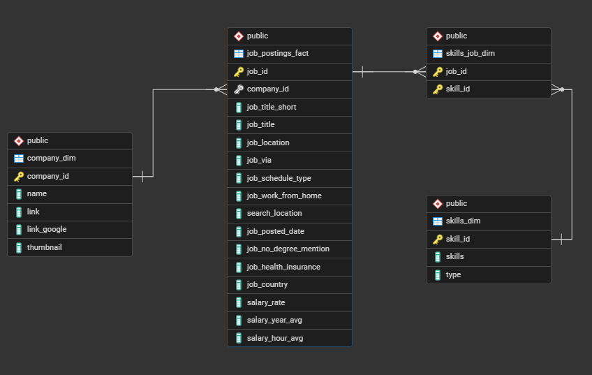
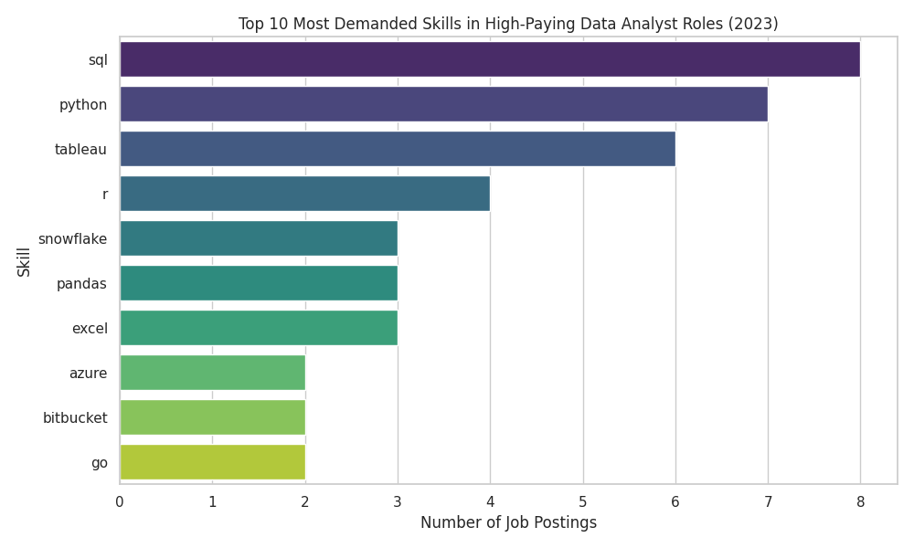
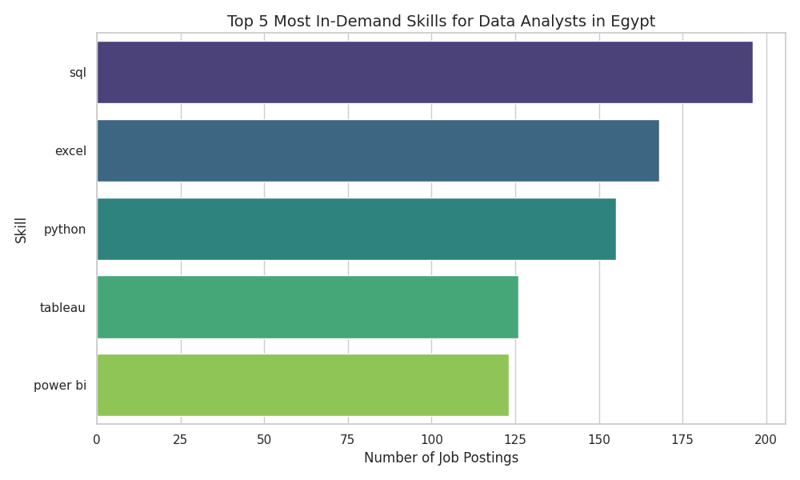
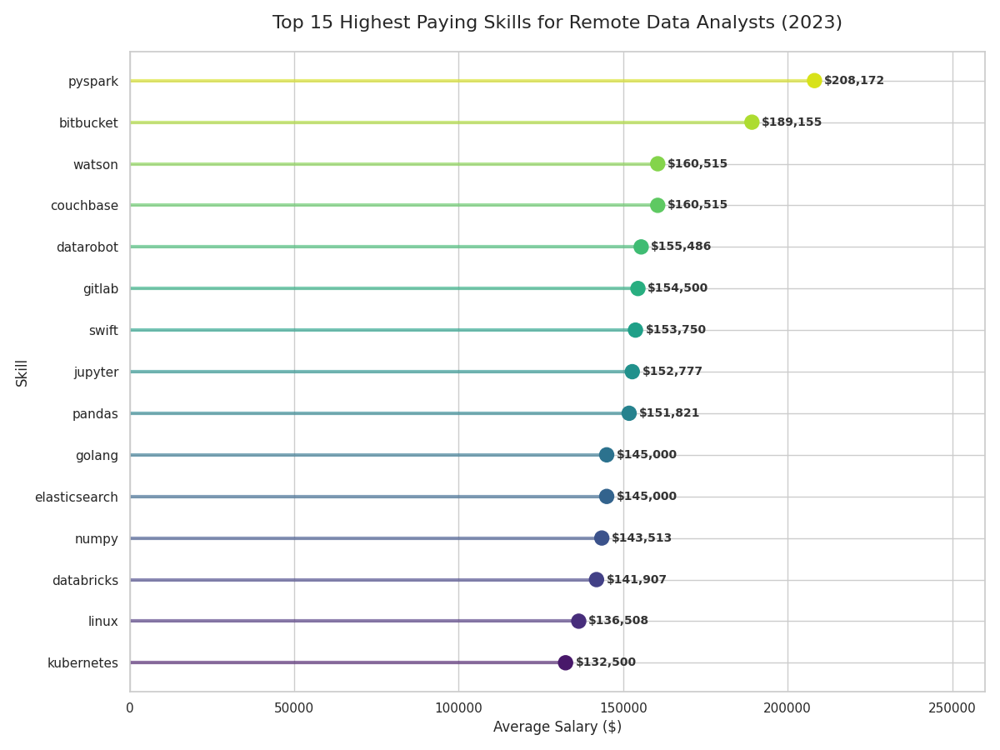
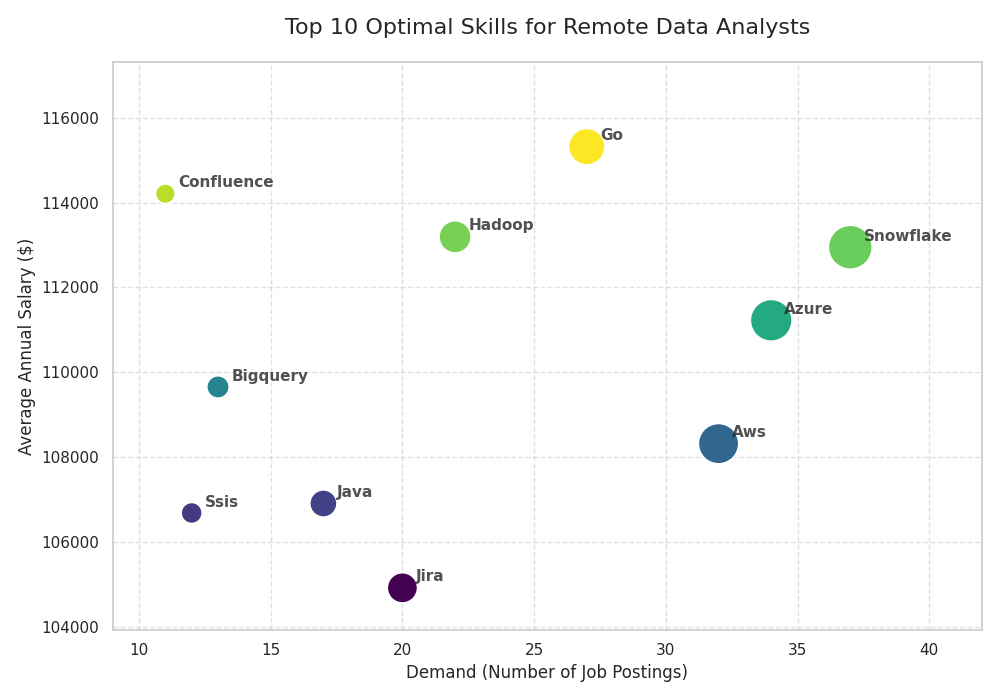

# Data Analyst Job Market Analysis (SQL Project)

## Introduction

This project explores the **global and Egyptian data analyst job market** using SQL to uncover:

* 💰 Top-paying **remote Data Analyst roles**
* 🛠️ Skills required for **high-paying jobs**
* 🔥 Most **in-demand skills in Egypt**
* 📈 Skills that combine **high demand and high salary**

The goal is to provide **data-driven guidance** for aspiring data analysts on **what skills to learn**, **how to prioritize learning**, and **where to focus career development**.

## Background & Motivation

As someone building a career in data analytics, I wanted to move beyond generic advice like *“learn SQL and Python”* and instead answer:

> **Which skills actually lead to better job opportunities and higher salaries?**

Using real-world job posting data from **2023**, this project analyzes thousands of listings to extract **practical and actionable insights** for data analysts.

## Dataset

The dataset includes real-world job postings data from 2023, such as **Job Titles**, **Salaries**, **Locations**, **Work type (remote / on-site)**, and **Skills**, along with other details that give a fuller picture of the job market.

📁 **Dataset Link:**
[https://drive.google.com/drive/folders/1egWenKd_r3LRpdCf4SsqTeFZ1ZdY3DNx?usp=drive_link](https://drive.google.com/drive/folders/1egWenKd_r3LRpdCf4SsqTeFZ1ZdY3DNx?usp=drive_link)

## Database Schema (ERD)

Understanding table relationships was essential for writing accurate joins and efficient queries.

## Questions This Project Answers

1. **What are the top-paying remote Data Analyst jobs?**
2. **What skills are required for those top-paying jobs?**
3. **What are the most in-demand skills for Data Analysts in Egypt?**
4. **Which skills are associated with higher salaries?**
5. **What are the most optimal skills to learn (high demand + high pay)?**

## Tools & Technologies Used

* **SQL** – Core querying language for analysis
* **PostgreSQL** – Database management system; converted raw CSV files into structured tables
* **VS Code** – Query execution & development
* **Git & GitHub** – Version control & portfolio hosting

## 📈 Analysis & Insights

### 1️⃣ Top-Paying Remote Data Analyst Jobs

This analysis identifies the **10 highest-paying remote Data Analyst roles** by filtering job postings based on salary and location, highlighting the most lucrative opportunities in the field.

**Key Insights:**

* 💰 Salaries range from **$184K to $650K**, showing strong earning potential.
* 🌍 All roles are **fully remote**, offering flexibility and global opportunities.
* 🏢 High-paying employers mainly come from **cloud, SaaS, and tech-driven industries**, reflecting where top compensation is concentrated.
* 📌 Job titles vary widely, from **Data Analyst to Director of Analytics**, highlighting diverse career paths within data analytics.

---

### 2️⃣ Skills Required for Top-Paying Jobs

This analysis identifies the **key skills employers look for in the highest-paying remote Data Analyst roles** by linking top-paying jobs with their required skill sets.

**Key Insights:**

* **SQL, Python, and Tableau** are the most frequently requested skills, highlighting their importance in high-paying roles.
* **Cloud technologies** like **AWS, Azure, and Snowflake** play a major role in boosting salary potential.
* **Big data and engineering tools** such as **Hadoop, BigQuery, Go, and Java** reflect the growing overlap between data analysis and data engineering.
* **Enterprise tools** like **Jira and Confluence** support collaboration and workflow management in high-impact teams.

---

### 3️⃣ Most In-Demand Skills for Data Analysts in Egypt

This query highlights the **top 5 skills most requested locally**.

| Skill    | Demand    |
| -------- | --------- |
| SQL      | Very High (196) |
| Excel    | Very High (168)|
| Python   | High      (155)|
| Tableau  | Medium    (126)|
| Power BI | Medium    (123)|

**Key Insights:**

* **SQL dominates** the Egyptian job market
* **SQL and Excel** remain core skills, forming the foundation for everyday data work, from cleaning and processing data to building reliable analyses.
* **Python and visualization tools** like **Tableau and Power BI** are increasingly important, helping analysts turn data into clear stories that support better decisions.

---

### 4️⃣ Highest Paying Skills (Remote Roles)

This analysis explores which skills are associated with the **highest average salaries** in remote Data Analyst roles, revealing what employers value most in top-paying positions.

**Key Insights:**

* **Big Data & Machine Learning tools** such as **PySpark, Couchbase, and DataRobot** command premium salaries due to their role in large-scale data processing and advanced analytics.
* **Cloud & DevOps technologies** like **Bitbucket, Watson, Elasticsearch, and Databricks** significantly boost earning potential, highlighting the growing importance of cloud-based and engineering-focused workflows.
* Overall, skills that blend **data analysis, engineering, and cloud computing** offer the strongest salary advantage.  

---

### 5️⃣ Most Optimal Skills to Learn (High Demand + High Salary)

This analysis combines **salary and demand data** to identify skills that offer the **best career return on investment (ROI)** for Data Analysts.

**Key Insights:**

* **Cloud platforms** such as **Snowflake, AWS, and Azure** provide the strongest career value, combining high demand with top salaries.
* **Big data and programming tools** like **Go, Hadoop, and BigQuery** offer excellent pay and growing market demand.
* **Enterprise and engineering tools** significantly boost earning potential, especially in advanced analytics roles.

Overall, focusing on **cloud, big data, and engineering-focused skills** can greatly improve job prospects and long-term earning potential.

## 🧠 Key Learnings

Throughout this project, I supercharged my SQL skills and gained hands-on experience with real-world data:

* **Advanced Querying:** Built complex queries, joined multiple tables, and used CTEs (`WITH` clauses) to structure my analysis efficiently.
* **Data Aggregation:** Mastered `GROUP BY`, `COUNT()`, and `AVG()` to summarize data and uncover meaningful patterns.
* **Analytical Thinking:** Turned raw job data into actionable insights, solving real-world problems with SQL.

## 🎯 Final Conclusions
### Insights
From the analysis, several general insights emerged:

1. **Top-Paying Data Analyst Jobs:** Remote roles can be highly lucrative, with salaries reaching up to **$650,000**.
2. **Skills for Top-Paying Jobs:** Advanced **SQL** is a must-have for landing the highest-paying positions.
3. **Most In-Demand Skills:** **SQL** dominates the job market, making it essential for any aspiring data analyst.
4. **Skills with Higher Salaries:** Niche skills like **SVN** and **Solidity** command premium salaries, highlighting the value of specialized expertise.
5. **Optimal Skills for Career Growth:** Combining demand and pay, **SQL** stands out as a top skill to focus on for maximum market value.

## 🚀 Final Thoughts

This project demonstrates how **SQL can turn raw job data into actionable career insights**. It strengthened my skills while uncovering which roles and skills are in high demand and high paying, providing a **practical roadmap** for aspiring data analysts, career switchers, and anyone planning **strategic skill development**. The analysis also highlights the importance of **continuous learning** and staying up to date with trends in the data analytics field.

